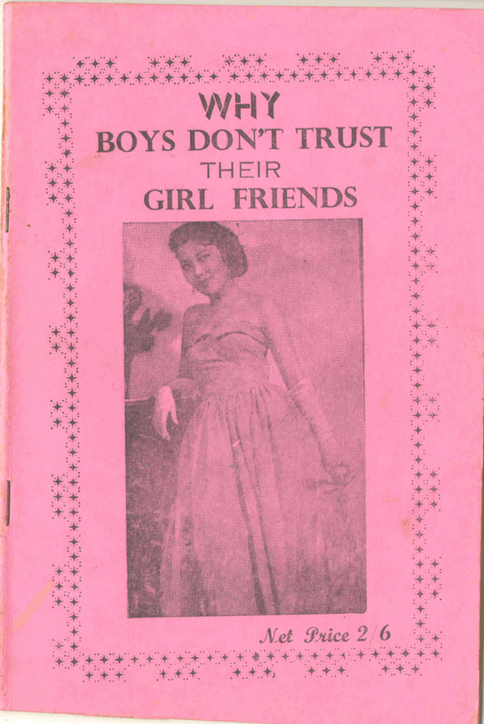

# WHY

# BOYS DON’T

# TRUST THEIR

# GIRL FRIENDS

----

## PREFACE

This pamphlet captioned why boys don’t trust their girl friends is the first of its kind specially to deliver boys from the hands of our girls, who are in the habit of duping, bluffing and asking for much gifts from the boys.  

This pamphlet makes several revelations. It is very interesting and wonderful. It is the first and best of its kind. 

It a guide for all boys and men in general. It is a pamphlet that everybody should read for information,advice, wisdom and mental entertainment.
 
N. O. NJOKU, 
(The Author)

----
